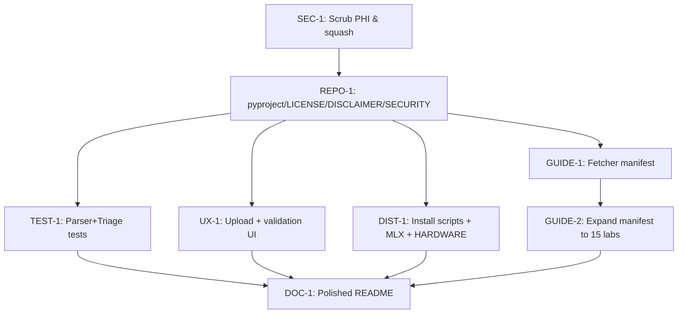

# Health-Chat — Open-Source Hardening Handoff

## Goal
Empower people to review their **own lab results** (common, confusing, important) in a **fully local, privacy-preserving** way. Local model (Qwen3.8-27B via llama.cpp/MLX) never uses training weights alone — it is grounded in **patient's own records (chunked PDFs) + curated guideline excerpts** (AAFP/ARUP/StatPearls) retrieved via BM25. No web search in v1. Person can download with simple command; agent can find and install it.

**Meta-goal:** Open source in hours, polished enough to publish. v1 = **labs-only proof of concept** with static corpus (fetched on install, not redistributed). Reframe to done-when-shipped, not perfect.

## Grilling Locked Decisions (2026-08-29)

| # | Decision | Why | Ticket |
|---|----------|-----|--------|
| 1 | **Scrub PHI, genericize, squash to clean single commit before publish** | `server.py` had patient-name strings + `~/lab-data`, `labs.json` + provider/phone/DOB on disk. `labs.json` was gitignored (safe, but `git add -A` risk). History is only 2 commits — squash trivial. | SEC-1 |
| 2 | **v1 = labs-only static corpus POC** | Vision = general health Q&A, but `resources/` only covers 6 domains. Honest scoping. Dynamic corpus deferred. | GUIDE-1/2 |
| 3 | **Top-15 labs via fetcher manifest, not verbatim excerpts in repo** | User clarified: provide links, user fetches corpus on install (copyright-safe). Since fetcher ships, "90 min copy-paste" becomes ~15 min adding URLs to manifest + expanding `_DOMAIN_KEYWORDS`. Future non-dev ticket can curate more. | GUIDE-2 |
| 4 | **127.0.0.1 by default, HOST env override** | User accepted change. Was `0.0.0.0` → liability with bold privacy claims. `server.py:HOST` now defaults `127.0.0.1`, `uvicorn.run(host=HOST)`. Docs must say not to expose port. | Already applied in this handoff |
| 5 | **Reframe hardware claim: 27B-only, no "fits many hardware"** | Qwen3.8 27B Q4 ~16.5GB → ~18GB RAM. 8GB Air OOMs. New claim: "Requires 32GB RAM or 16GB VRAM; see HARDWARE.md" + MLX option for Mac. | DIST-1 |
| 6 | **MIT + DISCLAIMER.md + SECURITY.md + UI banner** | Prompt walks diagnosis tightrope ("consistent with X ... only doctor can diagnose"). Needs loud non-advice disclaimer. | REPO-1 |
| 7 | **Ship fetcher, not verbatim txt** | AAFP content copyrighted. `resources/manifest.json` + `scripts/fetch_guidelines.py` → user fetches, we don't redistribute. | GUIDE-1 |
| 8 | **Drag-drop upload + validation table** | `~/lab-data` manual + Quest-only parser that silently returns `[]` for Labcorp is trust-killer. `POST /api/upload` + UI drop zone. | UX-1 |
| 9 | **Minimal parser+triage tests** | `parse_labs` 90-line regex moat has 0 tests. 30 min fixture tests prevent silent regression. | TEST-1 |
| 10 | **Polished patient README** | Not dev-minimal. Screenshots, Mac/Win 3-step install, hardware table, what-it-does/doesn't-do. | DOC-1 |
| 11 | **Future backlogs: dynamic corpus + PHI-safe search sanitization** | v2: agentic search ("model recognizes intersection → motivates search") must strip PHI (values, DOB, names) from query terms. Ticket now, build later. | BACKLOG-1/2 |

## Current State (as of handoff)

- `server.py` (584 lines): `DATA_DIR` now `./data` + `HOST=127.0.0.1`, `SYSTEM_TEMPLATE` genericized to "patient's records" + "their doctor", BM25 over `chunks` + per-domain `guidelines`, `parse_labs` Quest parser, `triage_guidelines`, job-based `/api/chat` polling. Already applied margin fixes.
- `resources/` 11 txt files exist but should be replaced by manifest+fetcher before publish (still present in working tree pre-squash; SEC-1 removes them from public commit).
- `static/index.html` says "Passcode was printed ... on the Mac" → needs generic wording (DOC/UX).
- No `pyproject.toml`, `requirements.txt`, `LICENSE`, `README.md`, `DISCLAIMER.md`, `SECURITY.md`, `HARDWARE.md`, tests, or install scripts.
- `.passcode` + `labs.json` on disk (gitignored). Must be excluded from public commit + added to `data/` flow.

## Architecture Intent (v1, unchanged)

```
PDFs in ./data → extract_text(pypdf) → chunk_text(600/100) → BM25
                                    → parse_labs → structured JSON (authoritative values)
resources/manifest.json → fetch → guideline chunks → per-domain BM25 → triage_guidelines(question)
Prompt = structured + raw chunks + guideline chunks + strict rules (answer ONLY from records/guidelines, cite short name, flag out-of-range, hedge diagnosis)
LLM = llama-server (OpenAI compat) at LLM_URL, default Qwen3.8-27B Q4_K_M (~16.5GB). MLX alternative on Mac.
Auth = Bearer PASSCODE, localhost-only.
```

## Ticket Graph (Mode B factory, parallelizable)



**Parallel waves:**
- Wave 1: SEC-1 (blocking publish, do first)
- Wave 2: REPO-1 + GUIDE-1 (can start together)
- Wave 3: GUIDE-2 + TEST-1 + UX-1 + DIST-1 (fan-out)
- Wave 4: DOC-1 (needs others)

## Acceptance Criteria (v1 "finished" definition)

- `git ls-files | grep -E "labs\\.json|\\.passcode"` empty; `grep -R PATIENT_NAME server.py static/` empty (case-sensitive check for prior patient name); public commit has no PHI.
- `server.py` binds `127.0.0.1` by default, `HOST` overridable; docs say not to expose.
- `README.md` patient-facing, Mac/Win 3-step install, screenshots placeholder, hardware table (27B Q4 16.5GB, 32GB RAM / 16GB VRAM, MLX on Mac), "What it doesn't do" (6→15 labs, Quest PDFs best, no web search in v1, not medical advice).
- `pyproject.toml` + `LICENSE` (MIT) + `DISCLAIMER.md` + `SECURITY.md` present.
- `resources/manifest.json` + `scripts/fetch_guidelines.py` work; `resources/*.txt` not in public tree (or in `resources/cache/` gitignored).
- `POST /api/upload` + drop zone + parsed labs table visible in UI; Quest parse success/fail per file.
- `tests/test_parse_labs.py` + `tests/test_triage.py` pass in CI/local.
- `scripts/install.sh` / `scripts/install.ps1` + `docs/HARDWARE.md` + `docs/MODELS.md` cover Qwen3.8-27B + MLX.
- Two BACKLOG tickets filed: dynamic corpus v2 + PHI-safe query sanitization.

## Out of Scope for v1

- Live web search (Tavily/SerpAPI), agentic query generation, MLX full integration beyond docs/scripts.
- Non-Quest parser formats beyond raw-chunk fallback (already does).
- Docker image (optional if easiest; not required).

## Constraints

- Keep `llama.cpp` primary, MLX as Mac option (not full dual-engine refactor unless trivial).
- Qwen3.8-27B oriented; no 7B/14B fallback tiers (document requirement honestly).
- Fully local v1 → bold privacy claims allowed, but must state localhost-only in SECURITY.md.
- No PHI in search terms (deferred to BACKLOG, but manifest URLs are safe).

## Existing Files to Reference

- `server.py:1-584` — source of truth for parser/BM25/triage/prompt
- `resources/` — current 11 txt files to be converted to manifest
- `static/index.html` — gate + composer UI, needs Mac-specific string fix
- `labs.json` (local only, not to publish) — example parsed output
- `.gitignore` — currently `.passcode`, `labs.json`, `.venv/`
